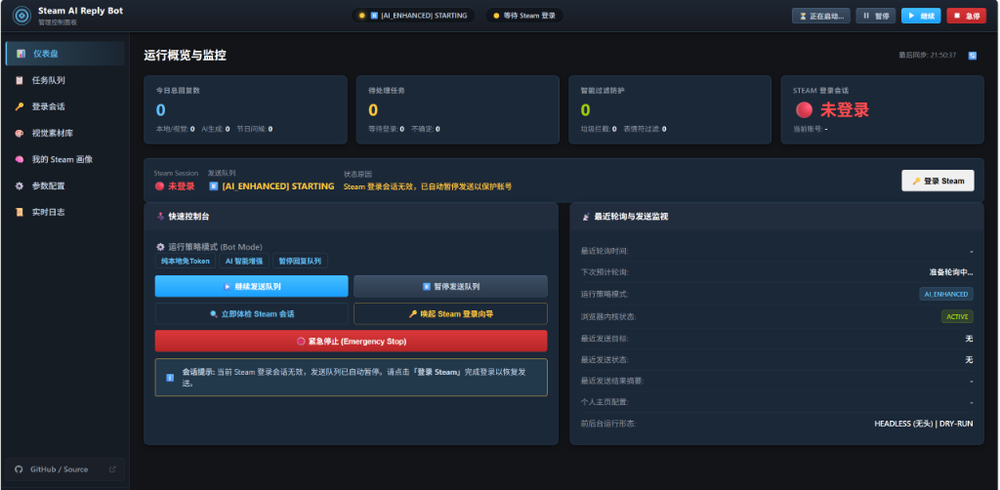
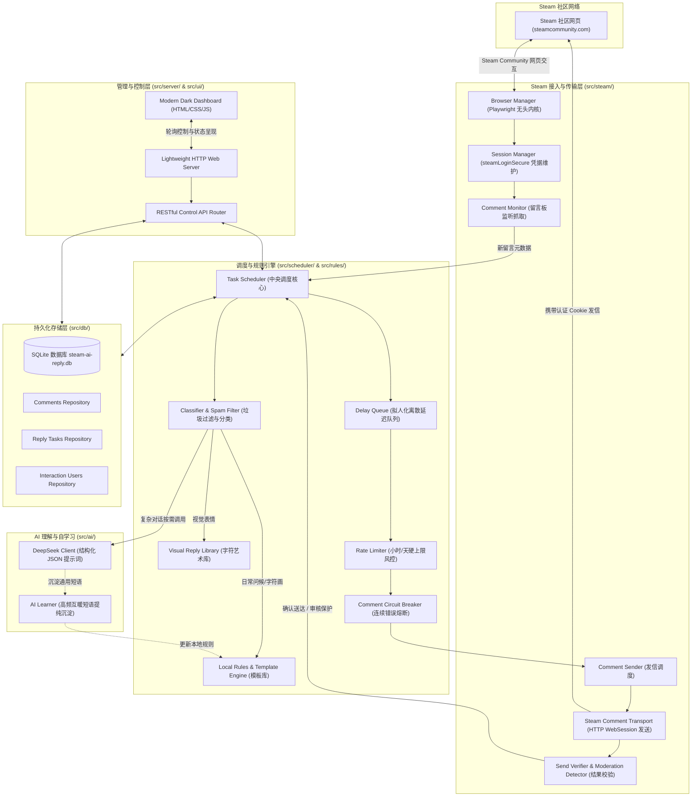
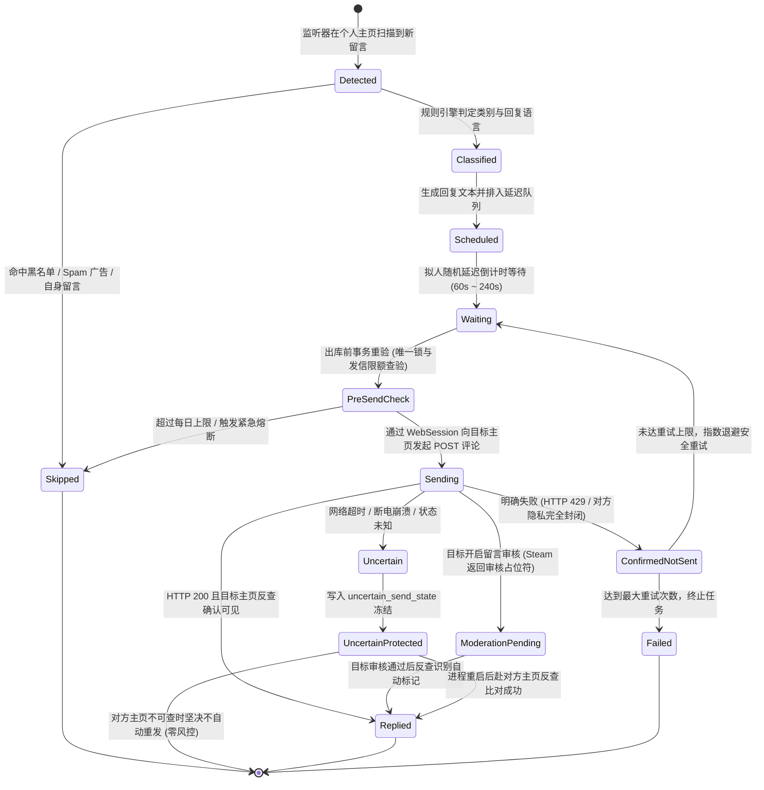

# SteamAIReplyBot

<p align="center">
  
</p>

<p align="center">
  <strong>专为 Windows 本机与低配云服务器设计的轻量级 Steam 社区留言板互暖自动回复机器人。</strong><br>
  <em>Local-first 本地规则优先，AI 智能按需增强，零重复发送风控，支持 Windows 后台静默挂机与可视化 Web 控制面板。</em>
</p>

<p align="center">
  <a href="https://github.com/Xiaevre/SteamAIReplyBot"></a>
  <a href="#5-三种运行模式"></a>
  <a href="#15-测试与稳定性保证"></a>
  <a href="#12-windows-后台运行与开机自启动"></a>
  <a href="#17-开源协议"></a>
</p>

---

## 1. 项目一句话定位

**SteamAIReplyBot** 是一款专注于 Steam Profile 社区互暖文化的自动化伴侣。它遵循礼貌互暖准则（**对方前往我的主页留言 $\to$ 机器人前往对方主页留言回复**），采用 **Local-first（本地规则优先）** 架构。绝大多数问候、夸奖、+rep 与表情字符画均以 **0 Token 本地免开销** 完成；仅在遇到复杂长句时按需调用 DeepSeek 大语言模型，并在状态不确定时实行极致保守的失败保护，杜绝重复回复与刷屏风控。

项目主页：[https://github.com/Xiaevre/SteamAIReplyBot](https://github.com/Xiaevre/SteamAIReplyBot)

---

## 2. Web UI 控制面板预览

机器人内置了开箱即用的极简深色 Web 管理仪表盘（默认监听本地 `http://127.0.0.1:3000` 或随机端口），提供实时状态监控与便捷运维：

<p align="center">
  
</p>

---

## 3. 项目解决什么问题

1. **解决自言自语与互动方向倒置**：很多自动化脚本错误地在玩家自己的主页回复，造成留言板混乱。本项目严格前往**来访者自己的个人主页**回踩，真正符合 Steam 社区社交礼仪。
2. **解决 Token 与 API 成本浪费**：Steam 社区 90% 以上的留言为日常问候、互踩、脚印、+rep、颜文字或字符画。本项目内置高频短语库与视觉字符库，日常互动 **0 Token 纯本地运行**，无需承担昂贵的 API 账单。
3. **解决网络超时引发的重复发信风控**：Steam 社区服务器在高峰期经常发生 HTTP 504 超时或响应丢包。盲目重试会导致在对方主页连发多条相同内容进而触发封禁。本项目采用五层保守幂等保护，彻底杜绝重复发信。
4. **解决低配云服务器 OOM 崩溃**：针对主流 1 核 1G 内存（1C1G）Windows VPS 进行了深度裁剪优化，主动拦截无头浏览器中的图片视频流与追踪脚本，日常静默挂机内存稳定压降至 **40MB ~ 60MB**。
5. **解决控制台黑框打扰日常使用**：Windows 下双击 EXE 启动默认隐藏控制台黑框，支持系统级计划任务随机器无感开机常驻。

---

## 4. 核心功能

- **Local-first 规则引擎**：精准分类日常打招呼、暖贴回踩、主页夸奖、+rep、颜文字表情与 ASCII / 盲文字符画，本地毫秒级匹配。
- **AI 智能理解与短语自学习**：复杂或多语言个性化留言由 DeepSeek AI 处理；AI 提炼出的高频短语经过多轮置信度校验后，自动晋升为本地免 Token 规则。
- **拟人化随机延迟调度**：收到留言后在设定的时间窗口（如 60s ~ 240s）内离散发送，避免瞬间并发引发 Steam 反作弊风控。
- **频次硬上限熔断**：支持配置每小时发信上限（如 10 条）与每日发信上限（如 50 条），防止短时间内留言突增导致账号被限流。
- **审核中状态 (Moderation Pending) 深度兼容**：完美支持对方主页开启“留言审核后展示”的特殊机制，不因留言暂未展示而误判重发。
- **主动节日温暖问候**：支持元旦、除夕、春节等重要节日，仅向近期有良好互动记录的活跃访客发送随机时间点的定制祝福。
- **Windows 隐形静默运行**：原生 C# 启动器封装，无 CMD 黑框打扰，支持通过 Web 界面或命令行一键开关开机自启。

---

## 5. 三种运行模式

机器人支持在 Web 控制面板或配置文件中随时无感平滑切换：

| 模式名称 | 核心行为 | Token 消耗 | 适用场景 |
| :--- | :--- | :---: | :--- |
| **`LOCAL_ONLY`** | **纯本地免 Token 模式**<br>仅依赖本地短语知识库、日常模板池及视觉字符画回复。 | **恒为 0** | 未购买 DeepSeek API 或希望 100% 零成本长期挂机的用户。 |
| **`AI_ENHANCED`** | **AI 智能增强模式（推荐）**<br>常规留言走本地免 Token 规则；遇到复杂聊天时按需调用大模型精准回复并沉淀短语。 | **极低**<br>(仅复杂对话消耗) | 追求自然对话表现力、多语言精准拟真回复的主页玩家。 |
| **`DISABLED`** | **安全监控模式**<br>保持监听留言板、分析访客与更新统计图表，但不向 Steam 发送任何真实回复。 | **0** | 网络调试、排查访客动态或临时维护期间使用。 |

---

## 6. 工作原理

```text
+-------------------+       +-----------------------+       +-------------------+
|   Steam 访客 A    | ----> |  我的 Steam 个人主页  | ----> |  SteamAIReplyBot  |
| (留下暖贴/脚印/+rep)|       |   (留言板检测到新留言)  |       |   (后台扫描并分类)  |
+-------------------+       +-----------------------+       +-------------------+
                                                                      |
                                                                      v (拟人随机延迟)
+-------------------+                                       +-------------------+
|   Steam 访客 A    | <------------------------------------ | 前往访客 A 的主页  |
| (收到一条温暖回访) |         (向对方留言板发表回复)         |  (完成闭环互暖)   |
+-------------------+                                       +-------------------+
```

1. **轮询监听**：机器人在配置的随机时间间隔内访问您自己的 Steam 主页留言板；
2. **过滤排重**：核对 SQLite 数据库，跳过已回复留言、自己发表的留言与垃圾引流内容；
3. **决策与生成**：根据运行模式决定走本地模板、视觉字符画还是 DeepSeek AI，生成定制回复文本；
4. **延迟入队**：为发信任务分配唯一 `taskId` 并推入拟人随机延迟队列；
5. **对向发信**：延迟到达后，通过本地已认证的 Steam Community 网页会话访问**对方主页留言板**完成评论发送；
6. **验真归档**：确认发信结果，更新任务状态机，写入 SQLite 持久化账本。

---

## 7. 系统架构图

本系统的技术分层完全对应项目源码实现：



---

## 8. 回复生命周期状态机

每一个检测到的留言都会经历严格的状态机流转。在任何环节遭遇未决异常，系统都会实行安全收敛，**绝不盲目重发**：



> **特别提示**：当任务进入 `UNCERTAIN`（例如发信过程中发生网络拔线或服务器断电），重启后系统会自动前往对方主页比对内容相似度与时间戳。**若因对方主页私密设置等原因无法 100% 确认是否已发信，系统将严格保持冻结状态，绝不自动重试**。

---

## 9. 安全与防重复发送机制

为保护账号免受社区留言刷屏惩罚，本项目构建了 **5 层纵深防重机制**：

1. **第 1 层：数据库物理级唯一约束**  
   SQLite 表结构中对 `steam_comment_id` 和任务索引强制配置 `UNIQUE` 约束，同一条留言物理层面无法插入第二次。
2. **第 2 层：单向不可逆状态流转**  
   状态机单向流转：一旦置为 `replied`，全局代码逻辑永久禁止对其发起发信操作。
3. **第 3 层：出库微秒级事务锁**  
   在调用网络发送接口的微秒前，再次加锁查验数据库，彻底隔绝任何多协程冲撞。
4. **第 4 层：Steam 待审核状态自愈识别**  
   针对开启“留言审核”的 Steam 主页，检测到审核提示文本时，标记为 `MODERATION_PENDING` 予以保护，不误判为发信失败。
5. **第 5 层：断电自愈反查算法**  
   若程序在发信瞬间遭遇掉电，重启后自动回访对方留言板进行文本相似度比对。确认存在则补标为已回复，无法确认则标记为不确定并坚决停发。

---

## 10. 快速开始

### 方式 A：预编译免安装版（推荐）

最终用户解压即可运行，无需预装 Node.js 或编译环境：

1. 前往 [Releases 页面](https://github.com/Xiaevre/SteamAIReplyBot/releases) 下载 `SteamAIReplyBot-v1.0.3-windows-x64.zip`；
2. 解压缩至任意目录（建议使用无空格的纯英文路径）；
3. 复制 `config.example.json` 为 `config.json`，填入您的 Steam 个人主页链接：
   ```json
   {
     "STEAM_PROFILE_URL": "https://steamcommunity.com/id/YOUR_STEAM_ID/",
     "DEEPSEEK_API_KEY": "YOUR_DEEPSEEK_API_KEY",
     "DRY_RUN": false
   }
   ```
   > *注：如仅使用纯本地 `LOCAL_ONLY` 模式，`DEEPSEEK_API_KEY` 保持原样或留空即可。*
4. **首次登录向导**：在解压目录下打开终端（PowerShell 或 CMD）执行：
   ```powershell
   .\SteamAIReplyBot.exe --login
   ```
   在弹出的 Chromium 浏览器窗口中于 Steam 社区官方登录界面输入账号密码并完成令牌确认，登录成功后窗口自动安全关闭；
5. **启动后台常驻**：直接双击 `SteamAIReplyBot.exe`（默认隐藏控制台黑框）或执行 `start-background.vbs`；
6. 在浏览器中打开 `http://localhost:3000` 进入 Web 控制面板。

---

### 方式 B：开发者源码运行

开发者可在 TypeScript 源码环境下调试与打包：

```bash
# 1. 克隆本仓库
git clone https://github.com/Xiaevre/SteamAIReplyBot.git
cd SteamAIReplyBot

# 2. 安装依赖
npm install

# 3. 编译 TypeScript 代码
node scripts/build.js

# 4. 执行全量 28 项自动化测试套件
node tests/runAllTests.js

# 5. 首次 Steam 登录向导
node dist/index.js --login

# 6. 开发者模式启动 (演练不真实发信)
node dist/index.js --dry-run

# 7. 打包输出 Windows 独立可执行程序
node scripts/package.js
```

---

## 11. 配置说明

配置支持通过 `config.json` 或环境变量 `.env` 进行配置，优先级为：**系统环境变量 > config.json > 内置默认值**。

| 字段名称 | 默认推荐值 | 作用说明 |
| :--- | :--- | :--- |
| `STEAM_PROFILE_URL` | `必填` | 您的 Steam 个人主页链接（用于监听谁来留了言） |
| `DEEPSEEK_API_KEY` | `选填` | DeepSeek API 密钥（`AI_ENHANCED` 模式必需，纯本地模式可留空） |
| `DEEPSEEK_MODEL` | `deepseek-chat` | 调用的模型名称 |
| `DEEPSEEK_BASE_URL` | `https://api.deepseek.com/v1` | API 基础地址（兼容 OpenAI 规范的代理服务） |
| `CHECK_INTERVAL_MIN_SECONDS` | `90` | 扫描自己留言板的最小随机间隔（秒） |
| `CHECK_INTERVAL_MAX_SECONDS` | `180` | 扫描自己留言板的最大随机间隔（秒） |
| `MIN_REPLY_DELAY_SECONDS` | `60` | 检测到新留言后，前往对方主页回复的最小随机延迟（秒） |
| `MAX_REPLY_DELAY_SECONDS` | `240` | 前往对方主页回复的最大随机延迟（秒） |
| `DRY_RUN` | `true` | 是否为试运行演练模式（`true` 时不向 Steam 真实发送评论） |
| `MAX_REPLIES_PER_HOUR` | `10` | 每小时发信硬上限（防限流风控） |
| `MAX_REPLIES_PER_DAY` | `50` | 每天发信硬上限 |
| `MEMORY_WARNING_MB` | `450` | 内存清理预警阈值（触发清理悬挂页面） |
| `MEMORY_CRITICAL_MB` | `700` | 内存自愈重建阈值（平滑重启 Context，不杀主进程） |
| `BOT_ENABLED` | `true` | 机器人总发信开关 |
| `EMERGENCY_STOP` | `false` | 紧急熔断开关（为 `true` 时立即清空待发队列） |

---

## 12. Windows 后台运行与开机自启动

### 1. 默认隐藏黑框控制台
直接双击 `SteamAIReplyBot.exe`，程序启动器会自动使用静默标志运行核心服务，不弹出任何黑色 CMD 窗口。如需查看控制台输出排查问题，只需附加任意参数运行即可（例如 `.\SteamAIReplyBot.exe --status`）。

### 2. Windows 系统计划任务（开机静默常驻）
程序内置了与 Windows Task Scheduler 深度集成的服务控制能力：
- **通过 Web UI 设置**：进入控制面板的“系统控制”面板，一键开启“开机自启动”开关；
- **通过命令行安装**：
  ```powershell
  .\SteamAIReplyBot.exe --install-service
  ```
- **通过命令行卸载**：
  ```powershell
  .\SteamAIReplyBot.exe --uninstall-service
  ```

---

## 13. AI 与 DeepSeek 深度结合（可选）

本项目绝不强制绑定商业 AI 服务：

- **0 Token 独立可用**：在 `LOCAL_ONLY` 模式下，程序完全依靠本地内置的短语知识库与视觉素材库运行，不发起任何 AI 网络请求，零成本永久运行。
- **高情商 AI 理解**：开启 `AI_ENHANCED` 后，遇到真正复杂的个性化留言（如询问游戏心得、探讨展示柜设计）时，调用 DeepSeek 大模型输出极具玩家真实感的回应，拒绝机械客服腔。
- **严格自学习机制**：AI 提炼出的常用互暖词语不会直接写入规则库，而是经过多轮不同访客场景的置信度检验后，才沉淀为稳定的免 Token 规则，防止规则库被污染。

---

## 14. 项目目录结构

```text
SteamAIReplyBot/
├── .env.example                 # 环境变量模板
├── .gitignore                   # Git 提交忽略规则
├── LICENSE                      # MIT 授权协议
├── README.md                    # 本文档
├── bootstrap.js                 # 运行时环境引导
├── config.example.json          # 核心配置文件模板
├── package.json                 # 依赖清单与脚本定义
├── patch-fs.js                  # Windows 路径与沙箱拦截补丁
├── runtime-control.example.json # 运行时模式与状态机控制模板
├── start-background.vbs         # VBS 脚本静默启动器
├── tsconfig.json                # TypeScript 编译选项
├── prompts/
│   └── reply-system.txt         # DeepSeek AI 系统提示词模板
├── scripts/
│   ├── build.js                 # TypeScript 编译构建脚本
│   ├── package.js               # Windows 可执行程序打包脚本
│   └── login.js                 # 交互式 Steam 登录脚本
├── src/
│   ├── index.ts                 # 主程序入口与 CLI 调度器
│   ├── launcher.cs              # 原生 Windows C# 无黑框静默启动器源码
│   ├── ai/                      # DeepSeek 客户端、短语提炼自学习器
│   ├── config/                  # 配置加载、类型校验与运行时控制状态机
│   ├── db/                      # SQLite 数据库引擎与 Repositories 仓储层
│   ├── reply/                   # 问候策略引擎、昵称解析、视觉字符生成器
│   ├── rules/                   # 分类器、Spam 过滤器、字符画与审核探测器
│   ├── scheduler/               # 任务调度器、延迟队列、频控器、熔断器
│   ├── server/                  # 轻量 HTTP 控制服务器与 RESTful API 路由
│   ├── steam/                   # 浏览器管理、会话生命周期、发信传输与反查
│   ├── ui/                      # 极简现代化深色 Web 仪表盘源码 (HTML/CSS/JS)
│   └── utils/                   # 诊断日志、服务注册、单实例互斥锁、路径解析
├── templates/
│   ├── blacklist.example.json   # 初始黑名单规则模板
│   ├── favorites.example.json   # 初始特别关注好友模板
│   ├── phrases.json             # 初始高频互暖短语知识库
│   ├── reply-templates.json     # 分类问候与夸奖模板库
│   └── visual-replies/          # 视觉字符艺术分类库 (ASCII/Braille/Emoji 等)
└── tests/
    ├── runAllTests.js           # 自动化测试总运行器
    └── unit/                    # 28 个核心架构自动化单元测试套件
```

---

## 15. 测试与稳定性保证

本项目坚持高质量交付，所有核心架构、状态机流转与边界安全均由自动化测试套件覆盖：

```powershell
node tests/runAllTests.js
```

```text
====================================================
Summary: 31/31 test suites PASSED
====================================================
[PASS] Suite 1:  Database Migration & Schema Resilience
[PASS] Suite 2:  Spam & Phishing Detection Accuracy
[PASS] Suite 3:  Local Rule & Zero-Token Matching
[PASS] Suite 4:  AI Reply Prompt & Learnable Phrases
[PASS] Suite 5:  Moderation Pending & Idempotency
[PASS] Suite 6:  Post-Send Verification & Recovery
[PASS] Suite 7:  Startup Session Health & Deferred Recovery
[PASS] Suite 8:  Rate Limiter & Daily Dispatch Hard Caps
[PASS] Suite 9:  Holiday Engine Discrete Scheduling
[PASS] Suite 10: Memory Governance & Page Lifecycle Leak
[PASS] Suite 11: Web Dashboard API & Endpoints
[PASS] Suite 12: Time Greeting Formatter & Nickname Injection
[PASS] Suite 13: Visual Expression & Braille Detection
[PASS] Suite 14: Single Instance Mutex Protection
[PASS] Suite 15: Safe Retry & Exponential Backoff
[PASS] Suite 16: Vanity URL Resolution & Cookie Pre-flight
[PASS] Suite 17: Profile Analysis & Historical Cache
[PASS] Suite 18: Path Resolution & Environment Fallbacks
[PASS] Suite 19: CLI Diagnostic Mode & Dry Run Simulation
[PASS] Suite 20: Playwright Temp Sandbox Isolation
[PASS] Suite 21: Session Lifecycle & Cookie Refresh
[PASS] Suite 22: Native C# Launcher Assembly & Flags
[PASS] Suite 23: Visual Reply Library CRUD Operations
[PASS] Suite 24: Graceful Stop & Resume Lifecycle Architecture
[PASS] Suite 25: Windows Background Execution & Autostart Architecture
[PASS] Suite 26: Startup Recovery & Interactive Login Race Safety
[PASS] Suite 27: Today Stats & Total Replies Accounting Accuracy
[PASS] Suite 28: Web UI DOM Hierarchy & Rendering Integrity
[PASS] Suite 29: Circuit Breaker & Queue Decoupling Acceptance
[PASS] Suite 30: Browser Profile Recovery & Lifecycle Stability
[PASS] Suite 31: Poll Decoupling, Incremental Catch-up & Diagnostics
```

---

## 16. 隐私与安全注意事项

1. **绝对不收集、不上报任何敏感数据**：本程序除直接与 Steam Community 网页端（进行留言板读写）及 DeepSeek API（生成回复文本）通信外，**不存在任何第三方服务器通信、遥测或后门**。
2. **账号与资产绝对安全**：
   - 登录过程使用 Playwright 启动 Chromium 访问 Steam Community 官方网页登录页面完成，账号密码直接提交至 Steam，本程序不截获、不保存、不上报您的凭证；
   - 本程序不具备任何涉及 Steam 钱包、交易报价、API Key 或饰品库存的权限与功能，所有逻辑仅限于公开社区主页留言板。
3. **数据完全归用户本地所有**：所有的运行数据（SQLite 数据库、Cookie 会话、短语库、日志）全部保存在用户本地的 `data/` 目录中，随时可由用户备份或彻底销毁。

---

## 17. 更新日志 (Changelog)

### v1.0.3
- **Poll 与 Recovery 完全解耦**：解决 Recovery 在遇到网络抖动或任务积压时长时间阻塞 Monitor Poll 轮询的问题，实行任务级独立等待窗口与非阻塞离散调度。
- **增量分页追赶 (Incremental Catch-up)**：Comment Monitor 支持自适应分页追赶并持久化 `lastSeenCommentId` 游标，彻底避免因 Steam 默认仅返回 6 条评论而产生留言漏判盲区。
- **发送失败分类与安全网络重试**：严格区分 Pre-Send 传输层网络故障与 Post-Attempted 未决超时；网络抖动重试与业务发信次数彻底解耦，保障网络偶发异常时不丢失发信机会。
- **UNCERTAIN 双重高置信度核验**：复用增量分页能力，结合双方 SteamID、时间窗口与回复指纹进行多因子核验；对高置信度一致未发送任务赋予最多一次安全补发机会 (`SAFE_TO_RESEND`)，并施加第三次 POST 硬锁保护杜绝多发。
- **运行诊断与一键导出脱敏包**：控制面板与 CLI 新增 Poll lag、延迟队列与熔断状态诊断展示，支持一键打包导出已全面脱敏的系统诊断包。

### v1.0.2
- **Browser lifecycle recovery**: 增加 Browser Profile 启动前健康检查，自动检测并安全清理孤立 `SingletonLock` / `lockfile` 残留，智能识别活跃 Edge 进程；Playwright 启动失败增加 3 级弹性退避重试（5s / 10s / 30s）。
- **Windows autostart stability improvements**: Windows 开机自启任务计划默认由 `ONSTART`（Session 0）全面优化为 `ONLOGON`（用户登录后以桌面会话运行），并加入 30 秒开机环境沉降等待窗口，彻底解决系统早期引导时 Edge `exitCode=1002` 问题。
- **Graceful shutdown support**: Web 控制面板顶部全新增加「退出程序」交互按钮，支持由前端通过 `POST /api/bot/exit` 优雅注销调度器、关闭浏览器内核、释放实例互斥锁与数据连接并完全退出进程。
- **Queue diagnostics improvements**: 持续优化控制台运行诊断输出，结构化输出 `[BROWSER_BOOT_CHECK]` 诊断指标，增强熔断状态与队列最老任务追踪展示。

---

## 18. 开源协议

本项目基于 [MIT License](LICENSE) 授权开源，欢迎提交 Issue 与 Pull Request 共同改进！
